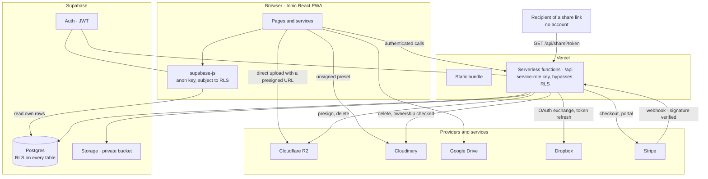

# ☁️ Cloud Storage App

[](https://opensource.org/licenses/MIT)
[](http://makeapullrequest.com)
[](https://cloud-storage-app-ionic-v0.vercel.app)

A modern, **open-source** web application for storing, viewing, and managing files with PWA and mobile device support. Built with Ionic + React + Supabase, with Stripe billing and five storage backends.

🔗 **[Live Demo](https://cloud-storage-app-ionic-v0.vercel.app)** | 💎 **[Pro tier](#-pro-tier)** | 📦 **[v3.0.0 release](https://github.com/Alexandr-Paleev/CloudStorageApp-Ionic/releases/tag/v3.0.0)**

> 💳 **The demo runs Stripe in test mode.** Real cards are declined — upgrade with `4242 4242 4242 4242`, any future expiry, any CVC. No money changes hands.

## 📋 Project Description

Cloud Storage App is a full-featured cloud file storage that allows users to:

- Securely store files in the cloud (PDFs, images, documents)
- View and manage files through a user-friendly interface
- Use the app on both web and mobile devices (iOS/Android)
- Automatically expand storage via Google Drive when the limit is exceeded
- Upgrade to a paid tier for more space and additional providers

## 📸 Screenshots

<p align="center">
  
</p>

| Upload — Pro users pick the backend | Plans — Stripe in test mode |
|---|---|
|  |  |

| File view | What a share link opens |
|---|---|
|  |  |

Share links are listed on the file they belong to, with their state and a way to revoke them:

<p align="center">
  
</p>

<p align="center">
  <br>
  <sub>The same dashboard as an installed PWA</sub>
</p>

## ✨ Key Features

### 🔐 Authentication

- ✅ Email/Password registration and login
- ✅ Google Account sign-in
- ✅ Protected routes (authorized users only)

### 📁 File Management

- ✅ File upload with progress indicator
- ✅ User file list view
- ✅ PDF and image preview
- ✅ File deletion (with full removal from Cloudinary)
- ✅ File renaming
- ✅ Metadata display (size, upload date, type)

### 💾 Storage

- ✅ **500 MB** free per user, **5 GB** on Pro
- ✅ Five backends: Cloudinary, Supabase Storage, Cloudflare R2, Google Drive, Dropbox (Pro)
- ✅ Images routed to Cloudinary, other files to R2/Supabase — Pro users can pick a provider by hand
- ✅ Automatic Google Drive connection when the limit is exceeded
- ✅ Visual storage usage indicator, honest about accounts that are over the limit
- ✅ Quota enforced server-side, not just in the UI

### 💳 Billing

- ✅ Free and Pro ($9/mo) tiers backed by Stripe
- ✅ Stripe Checkout for upgrades, Customer Portal for management
- ✅ Webhook keeps the tier in sync both ways — upgrade and cancellation
- ✅ Storage limits and allowed providers driven by the tier, not hardcoded

### 🔗 Sharing

- ✅ Public share links — send a file to someone without an account
- ✅ Links expire (7 days by default) and can be revoked from the file page
- ✅ Each file lists its links with their state: active, expired or revoked
- ✅ The recipient sees the file and nothing about its owner

> **What revoking does, precisely.** It stops `/s/:token` from opening. It cannot
> withdraw a file someone already downloaded, and on providers that serve
> permanent public URLs (Cloudinary, Dropbox, Google Drive) the direct file
> address keeps working for anyone who opened it. R2 and Supabase Storage are
> signed per request and do expire. The UI says this rather than promising a
> clean revoke.

### 📱 Platforms

- ✅ **Web** — works in any modern browser
- ✅ **PWA** — can be installed as an app on phone/computer (Service Worker + offline support)
- ✅ **iOS/Android** — native app support via Capacitor

> 📱 **PWA Ready!** Install the app on your device: [Testing Guide](PWA_TESTING.md)

### 🎨 Interface

- ✅ Responsive design (works on all screen sizes)
- ✅ Modern UI based on Ionic components
- ✅ Dark/light theme support (system settings)
- ✅ Smooth animations and transitions

## 🚀 Quick Start

### 1. Install Dependencies

```bash
npm install
```

### 2. Configure Environment Variables

Create a `.env` file in the project root:

```env
# Supabase Configuration
VITE_SUPABASE_URL=your_supabase_url
VITE_SUPABASE_ANON_KEY=your_supabase_anon_key

# Cloudinary Configuration
VITE_CLOUDINARY_CLOUD_NAME=your_cloud_name
VITE_CLOUDINARY_API_KEY=your_api_key
VITE_CLOUDINARY_UPLOAD_PRESET=your_upload_preset_name

# Required: API endpoint for file deletion
VITE_CLOUDINARY_DELETE_API_URL=https://your-project.vercel.app/api/cloudinary/delete

# Optional: Google Drive (for extra storage)
VITE_GOOGLE_CLIENT_ID=your_google_client_id

# Optional: Analytics (production only)
VITE_GA4_MEASUREMENT_ID=G-XXXXXXXXXX
VITE_HOTJAR_SITE_ID=1234567
VITE_HOTJAR_VERSION=6

# Billing — off by default, so a deployment without Stripe keys never shows a
# buy button that would answer with a 500
VITE_BILLING_ENABLED=true
# Shows the "test card" notice on the plans page; set while on Stripe test keys
VITE_BILLING_DEMO_MODE=true

# Optional: Dropbox (Pro tier provider)
VITE_DROPBOX_APP_KEY=your_dropbox_app_key
VITE_DROPBOX_REDIRECT_URI=https://your-project.vercel.app/dropbox/callback
# Server-side copy — the OAuth code is exchanged in /api/dropbox/*, never in
# the browser, so the key must also exist without the VITE_ prefix.
DROPBOX_APP_KEY=your_dropbox_app_key
```

> **Dropbox tokens are handled server-side.** The refresh token is stored in the
> `dropbox_connections` table (see `migrations/003_add_dropbox_connections.sql`)
> and never reaches the browser; the app holds only a short-lived access token,
> in memory. Run migration 003 before enabling Dropbox.

### 3. Service Setup

#### Supabase

1. Create a project on [Supabase.com](https://supabase.com/)
2. Run every file in `migrations/` in the SQL Editor, in numerical order:
   - `000` — `files` and `folders`, with their RLS policies
   - `001` — the `profiles` table billing depends on
   - `002` — closes a privilege-escalation hole in the profiles RLS
   - `003` — the table that keeps Dropbox refresh tokens off the client

   All four are safe to re-run, so there is no need to track which ones have
   already been applied.
3. Enable **Google Auth** in Authentication -> Providers if needed.
4. Set up a private bucket named `files` in Storage.

#### Cloudinary

1. Register on [Cloudinary](https://cloudinary.com/users/register/free)
2. Create an **Upload Preset**:
   - Settings → Upload → Upload presets → Add upload preset
   - Preset name: `cloud-storage-app` (or any other)
   - Signing mode: `Unsigned`
   - Asset folder: leave empty
3. Enable PDF delivery: Settings → Security → Allow delivery of PDF and ZIP files

#### Vercel API (for file deletion)

1. Register on [Vercel](https://vercel.com/)
2. Connect your Git repository
3. Add environment variables in Vercel. **Server-only — never with a `VITE_`
   prefix**, which would inline them into the public bundle:
   - `CLOUDINARY_CLOUD_NAME`, `CLOUDINARY_API_KEY`, `CLOUDINARY_API_SECRET`
   - `SUPABASE_URL`, `SUPABASE_SERVICE_ROLE_KEY`
   - `STRIPE_SECRET_KEY`, `STRIPE_PRICE_ID_PRO_MONTHLY`, `STRIPE_WEBHOOK_SECRET`
   - `DROPBOX_APP_KEY` (only if Dropbox is enabled)
4. After deployment, copy the API URL and add it to `.env`:
   - `VITE_CLOUDINARY_DELETE_API_URL=https://your-project.vercel.app/api/cloudinary/delete`

> ⚠️ Check that `SUPABASE_SERVICE_ROLE_KEY` really holds the **service-role**
> key, not the anon key — they look alike and Supabase shows them side by side.
> Pasting the wrong one leaves every server-side query silently returning zero
> rows. See the [postmortem](#-postmortem-the-anon-key-that-was-named-supabase_service_role_key)
> for the one-liner that tells them apart.

#### Stripe (for the paid tier)

1. Create a product and a monthly price in the [Stripe Dashboard](https://dashboard.stripe.com/)
   and put the price id in `STRIPE_PRICE_ID_PRO_MONTHLY`
2. Add a webhook endpoint pointing at `https://your-project.vercel.app/api/stripe/webhook`,
   subscribed to `checkout.session.completed`, `customer.subscription.updated`,
   `customer.subscription.deleted` and `invoice.payment_failed`
3. Copy that endpoint's signing secret into `STRIPE_WEBHOOK_SECRET` — the one
   `stripe listen` prints is for local development only and will not verify
   production events
4. Set `VITE_BILLING_ENABLED=true` to show the plans page, and
   `VITE_BILLING_DEMO_MODE=true` while running on test keys
5. Locally, forward events instead of registering an endpoint:
   `stripe listen --forward-to localhost:8100/api/stripe/webhook`

#### Google Drive (optional)

1. Create a project in [Google Cloud Console](https://console.cloud.google.com/)
2. Enable Google Drive API
3. Create OAuth 2.0 Client ID
4. Add `VITE_GOOGLE_CLIENT_ID` to `.env`

#### Analytics (optional)

Analytics are automatically enabled in production when environment variables are set.

**Google Analytics 4:**
1. Create a property in [Google Analytics](https://analytics.google.com/)
2. Get your Measurement ID (starts with `G-`)
3. Add `VITE_GA4_MEASUREMENT_ID` to `.env`

**Hotjar:**
1. Create a site in [Hotjar](https://www.hotjar.com/)
2. Get your Site ID from the tracking code
3. Add `VITE_HOTJAR_SITE_ID` to `.env`

> **Privacy First**: Hotjar only runs on web (not native mobile apps). File names and sensitive data are automatically masked using `data-hj-suppress` attributes.

### 4. Run Application

```bash
# Development mode
npm run dev

# Production build
npm run build

# Preview build
npm run preview
```

The app will be available at: `http://localhost:5173`

## 📦 Tech Stack

- **UI Framework**: Ionic React 8.0
- **Frontend**: React 18 + TypeScript
- **File Storage**: Cloudinary, Supabase Storage, Cloudflare R2, Google Drive, Dropbox (Pro)
- **Database**: Supabase (PostgreSQL, RLS)
- **Authentication**: Supabase Auth
- **Billing**: Stripe (Checkout, Customer Portal, webhooks)
- **State Management**: TanStack Query + React Context API
- **Routing**: React Router DOM
- **Build**: Vite + Capacitor
- **Backend API**: Vercel Functions
- **Testing**: Vitest (unit) + Playwright (e2e), run in GitHub Actions
- **Analytics**: Google Analytics 4 (GA4) + Hotjar
- **Error Tracking**: Sentry

## 🏗️ Architecture



**The rule the layout follows:** anything holding a secret runs in `/api`. The
browser bundle is public — Vite inlines every `VITE_`-prefixed value into it —
so provider credentials, the Stripe secret key, the Supabase service-role key
and Dropbox refresh tokens are only ever read server-side. The client talks to
Postgres directly, but always through the anon key with RLS applied, and only
for rows it owns.

Uploads are the deliberate exception: files go from the browser straight to R2
using a presigned URL, because proxying them through a serverless function would
cap uploads at Vercel's 4.5 MB request body limit. The quota is therefore
enforced when the URL is signed, and the approved size is signed into it.

### Security decisions worth knowing

| Decision | Reason |
|---|---|
| Billing columns are server-write only | RLS has no column-level granularity, so a self-update policy would let anyone set `tier = 'pro'` |
| Dropbox refresh tokens live in `dropbox_connections`, never in the browser | an XSS could otherwise reach the user's Dropbox indefinitely |
| Share tokens are stored as SHA-256 hashes | a leak of `shared_links` then reveals nothing usable |
| `assertServiceRoleKey` refuses to start on an anon key | swapping the two keys fails silently: queries return nothing instead of erroring |
| Quota and ownership are checked in `/api`, never trusted from the client | the client check is advisory; the presigned URL writes straight to the bucket |

## 🚀 Deployment

### Vercel (recommended)

1. Install Vercel CLI: `npm install -g vercel`
2. Deploy: `vercel --prod`

## 📱 Mobile App Publication

### Android

```bash
# Build web app
npm run build

# Add Android platform
npx cap add android

# Open in Android Studio
npx cap open android
```

In Android Studio, build APK or AAB for Google Play Store.

### iOS

```bash
# Add iOS platform
npx cap add ios

# Open in Xcode
npx cap open ios
```

**Requirements**: Mac with Xcode installed and an Apple Developer account ($99/year).

## 📁 Project Structure

```
cloud-storage-app/
├── src/
│   ├── pages/
│   │   ├── Login.tsx              # Login/Register page
│   │   ├── Dashboard.tsx          # User file list
│   │   ├── Upload.tsx             # File upload page
│   │   └── FileView.tsx           # File view/manage page
│   ├── services/
│   │   ├── auth.service.ts        # Authentication service
│   │   ├── storage.service.ts     # Main file service
│   │   ├── cloudinary.service.ts  # Cloudinary service
│   │   ├── googledrive-auth.service.ts  # Google Drive OAuth
│   │   └── googledrive.service.ts # Google Drive service
│   ├── providers/
│   │   ├── storage.provider.ts    # Storage Provider architecture
│   │   └── impl/                  # Provider implementations
│   ├── contexts/
│   │   └── AuthContext.tsx        # Authentication context
│   ├── components/
│   │   ├── PrivateRoute.tsx       # Protected route component
│   │   └── PageViewTracker.tsx    # Analytics page view tracker
│   ├── hooks/
│   │   └── useAnalytics.ts        # GA4 + Hotjar analytics hook
│   ├── types/
│   │   └── analytics.types.ts     # Analytics event types
│   ├── supabase/
│   │   └── supabase.config.ts     # Supabase configuration
│   ├── App.tsx                    # Main component
│   └── main.tsx                   # Entry point
├── api/                           # Vercel Functions — anything holding a secret
│   ├── cloudinary/delete.ts       # Ownership-checked asset deletion
│   ├── dropbox/                   # OAuth exchange, token refresh, disconnect
│   ├── r2/                        # Presigned URLs, quota enforced here
│   └── stripe/                    # Checkout, Customer Portal, webhook
├── lib/                           # Shared by api/ and tests (auth, stripe, format)
├── migrations/                    # The whole schema, in order, each re-runnable
├── e2e/                           # Playwright specs
├── capacitor.config.ts            # Capacitor config
├── vite.config.ts                 # Vite config (incl. vendor chunk splitting)
└── package.json
```

Anything that needs a secret lives in `api/`. The browser bundle is public — Vite
inlines every `VITE_`-prefixed value into it — so provider credentials, the
Stripe secret key, the Supabase service-role key and Dropbox refresh tokens are
only ever read server-side.

## 🔒 Limits and Restrictions

### Application

| | Free | Pro ($9/mo) |
|---|---|---|
| Storage | 500 MB | 5 GB |
| Providers | Cloudinary, Supabase Storage, R2, Google Drive | + Dropbox |
| Provider selection | automatic | manual, per upload |

- **Extra storage**: Google Drive (15 GB free) — auto-connects when limit is reached
- **Max single file size**: 50 MB
- Cancelling Pro drops the limit back to 500 MB. Files already stored stay
  readable; only new uploads are refused until the account is back under quota.

### Cloudinary (Free Plan)

- **Storage**: 25 GB
- **Bandwidth**: 25 GB/month
- **Transformations**: 25,000/month

### Supabase (Free Tier)

- **Database**: 500MB
- **Storage**: 1GB (5GB bandwidth)

## 🛠️ Development

```bash
# Linting
npm run lint

# Code formatting
npm run format

# Unit tests (Vitest)
npm test

# End-to-end tests (Playwright)
npm run test:e2e

# Type-check src and api, then build
npm run build
```

GitHub Actions runs lint, both type-check passes, unit and e2e tests on every
pull request. `main` is protected: those checks are required, and changes land
through pull requests only.

## 🔍 Postmortem: the `anon` key that was named `SUPABASE_SERVICE_ROLE_KEY`

Worth writing down, because no test in this repository could have caught it —
the bug was not in the code at all.

**The symptom.** Right after billing went live in production, `Upgrade to Pro`
answered with `500` and a message the handler itself raises:

```
No profile row for user 4a242a2f-... — has migrations/001_add_profiles_and_billing.sql been run?
```

The migration had been run. The row was there — a direct query against the
database returned it, `stripe_customer_id` and all.

**The cause.** Every serverless function builds its Supabase client in
`lib/auth.ts` from `SUPABASE_URL` and `SUPABASE_SERVICE_ROLE_KEY`. The project
URL was correct. The key was not: decoding the JWT payload showed
`"role": "anon"`. An anon key had been stored under the service-role name, in
all three Vercel environments, 221 days earlier.

A service-role key bypasses RLS; an anon key does not. `profiles` allows
`SELECT` only on `auth.uid() = id`, and a server-side client carries no user
session — so it matched zero rows. Postgres was not broken and RLS was not
misconfigured. The server was simply asking as a stranger.

**Why it stayed hidden for so long.** Until v3 the production branch had no
`api/` directory, so none of this code ever ran there. It also survived a
signed-webhook check that returned `200`: that probe used an event type the
handler ignores, so it never touched the database. The first request that
actually read a table was the one that failed.

**How to check a key in one line.** The role is in the JWT payload, in plain
sight:

```bash
# prints: anon  — or: service_role
cut -d. -f2 <<< "$SUPABASE_SERVICE_ROLE_KEY" | base64 -d 2>/dev/null | sed 's/.*"role":"\([^"]*\)".*/\1/'
```

**What it changed here.** Two habits, both cheap:

- verify what a secret _is_, not what the variable is called — names are set by
  hand, and a hand can paste the wrong value;
- when a green check is claimed as proof, ask which code path it actually
  exercised. A `200` from a probe that never reached the database proved only
  that the signature matched.

A sibling of the same class had been fixed days earlier: `STRIPE_WEBHOOK_SECRET`
in production held a secret from `stripe listen`, left over from local testing,
while the Stripe account had no registered webhook endpoint at all. Both were
configuration, both were invisible to CI, and both only surfaced when a real
request finally travelled the whole path.

## 💎 Pro Tier

Shipped in [v3.0.0](https://github.com/Alexandr-Paleev/CloudStorageApp-Ionic/releases/tag/v3.0.0). Upgrading happens in the app, through Stripe Checkout.

| | Free | Pro — $9/month |
|---|---|---|
| Storage | 500 MB | **5 GB** |
| Providers | Cloudinary, Supabase Storage, R2, Google Drive | **+ Dropbox** |
| Choose upload provider | — | ✅ |
| Google Drive overflow | ✅ | ✅ |

Manage or cancel a subscription from the Stripe Customer Portal, reachable from
the plans page. Cancelling takes effect immediately and the tier drops back to
Free — see [Limits](#-limits-and-restrictions) for what happens to files already
stored.

> **The public demo runs on Stripe test keys.** Real cards are declined; use
> `4242 4242 4242 4242` with any future expiry and any CVC. Nothing is charged.

### Not built (and not promised)

Earlier versions of this README advertised OneDrive, AWS S3, team collaboration
and white-labelling as "coming soon". None of that exists, and none of it is
planned — the list is gone rather than left to age.

## 🤝 Contributing

We welcome contributions! Please follow these steps:

1. Fork the repository
2. Create a feature branch (`git checkout -b feature/AmazingFeature`)
3. Commit your changes (`git commit -m 'feat: add amazing feature'`)
4. Push to the branch (`git push origin feature/AmazingFeature`)
5. Open a Pull Request

Code style is enforced automatically — ESLint and Prettier run on staged files through a pre-commit hook, so there is nothing to configure by hand. Commit messages follow [Conventional Commits](https://www.conventionalcommits.org/) (`feat:`, `fix:`, `chore:`).

## 📝 License

This project is licensed under the MIT License - see the [LICENSE](LICENSE) file for details.

## 🤝 Support

- 💬 **Issues**: [GitHub Issues](https://github.com/Alexandr-Paleev/CloudStorageApp-Ionic/issues)
- 📧 **Email**: support@cloudstorage.app (for Pro customers)

## 📄 Legal

- **[Privacy Policy](PRIVACY_POLICY.md)** - How we handle your data
- **[Terms of Service](TERMS_OF_SERVICE.md)** - Rules and guidelines

## 🌟 Star History

If you find this project useful, please give it a ⭐ on GitHub!

---

**Created with ❤️ by Aleksandr Paleev**

**Stack**: Ionic + React + TypeScript + Supabase + Cloudinary + Vercel
