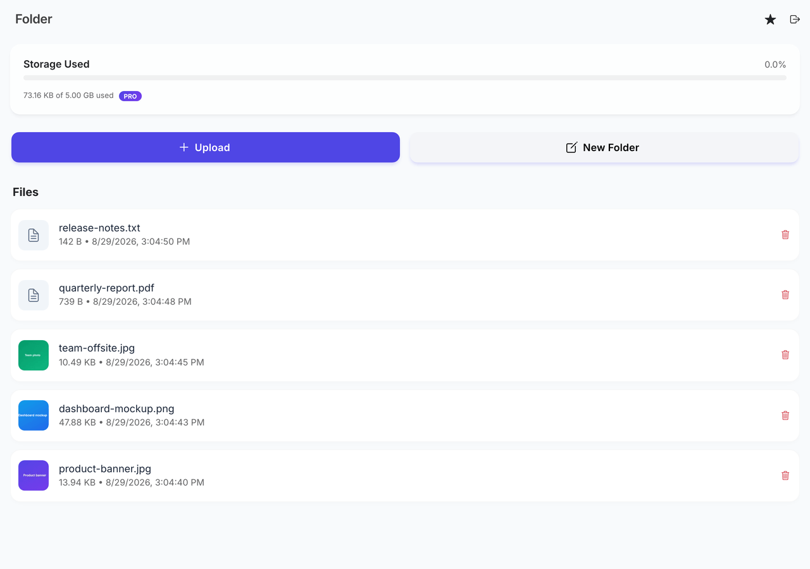
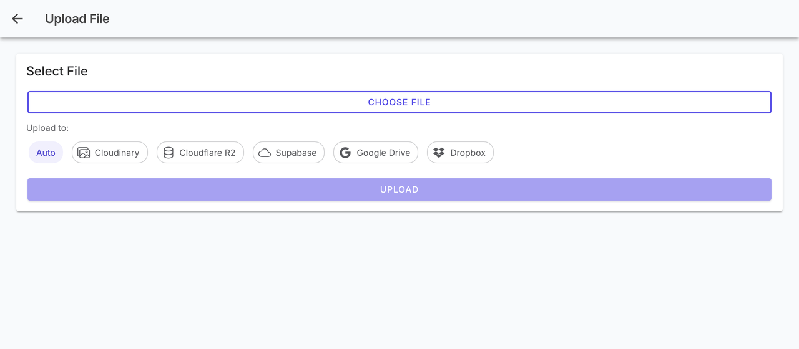
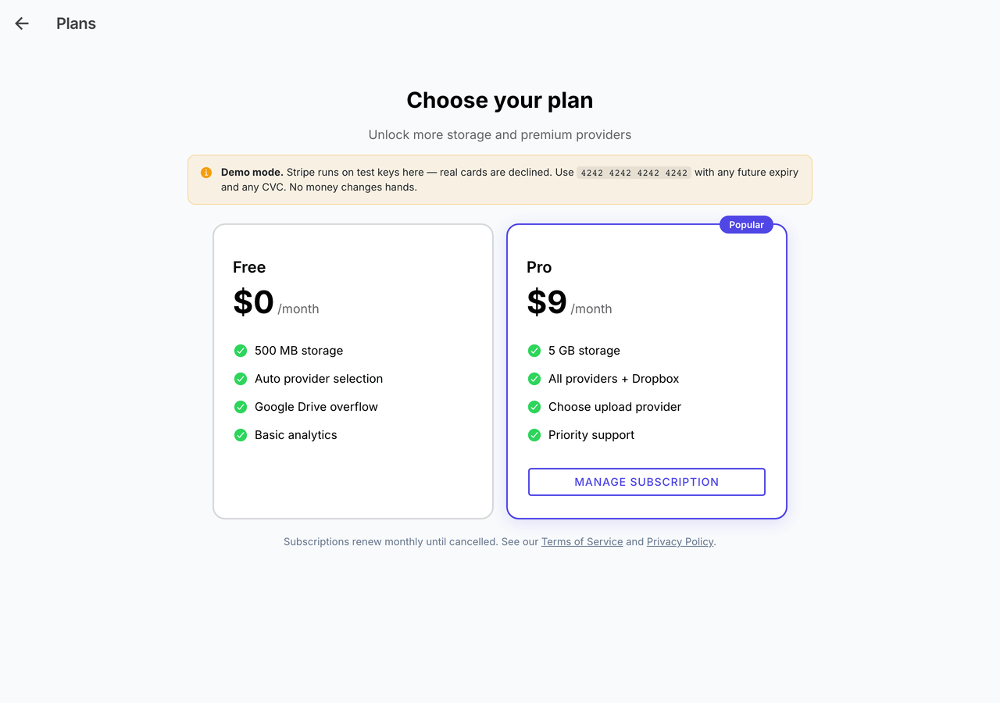
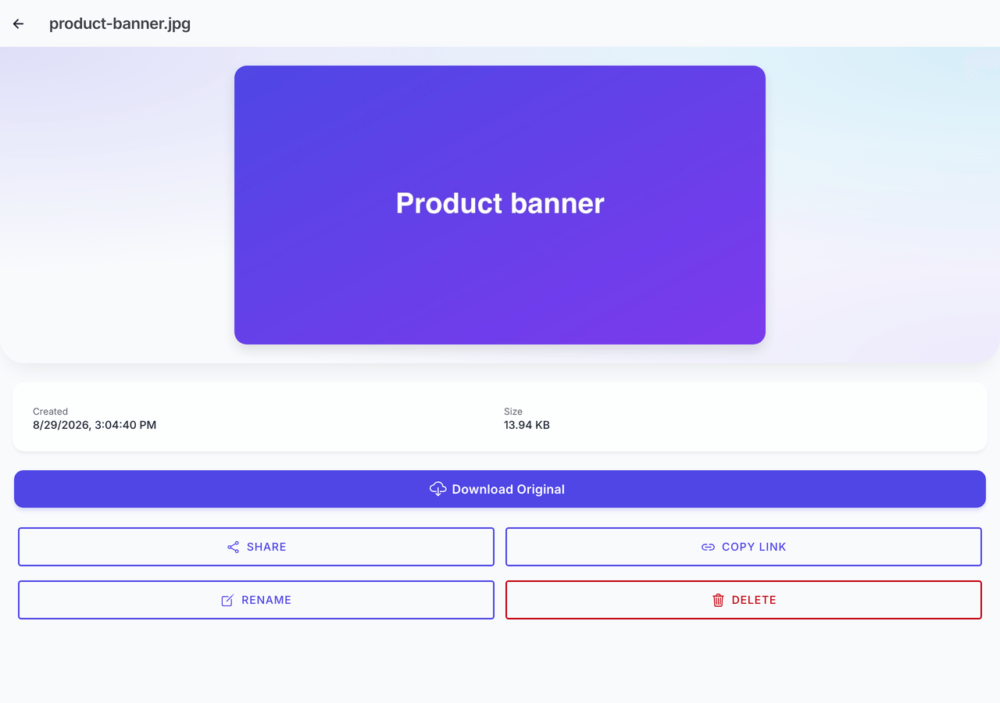
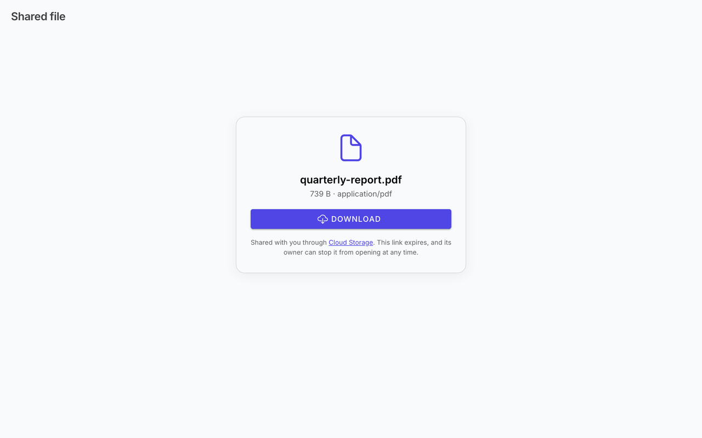
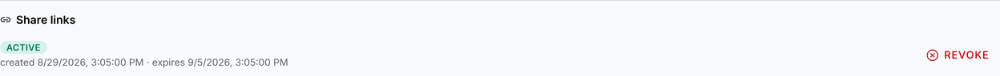
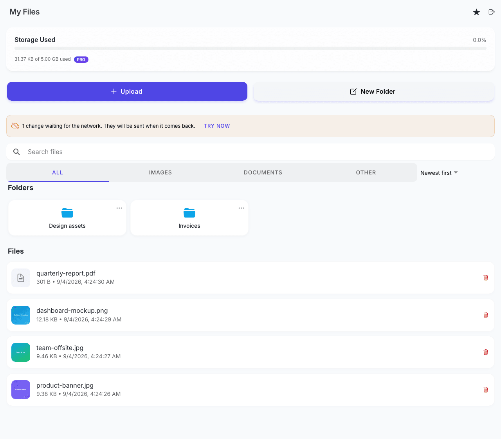
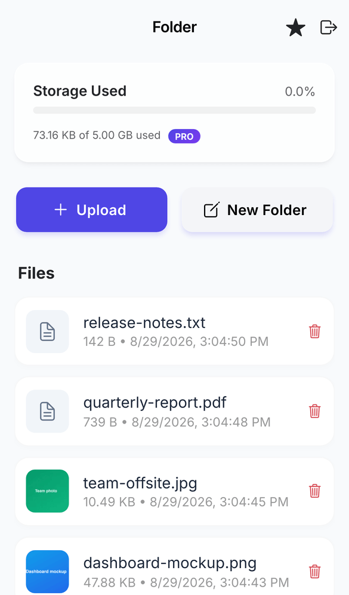
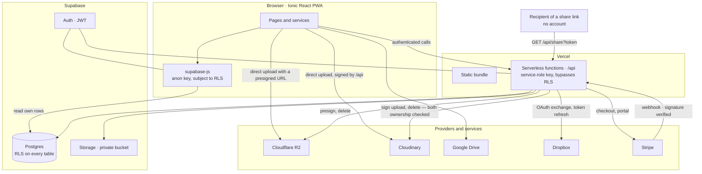
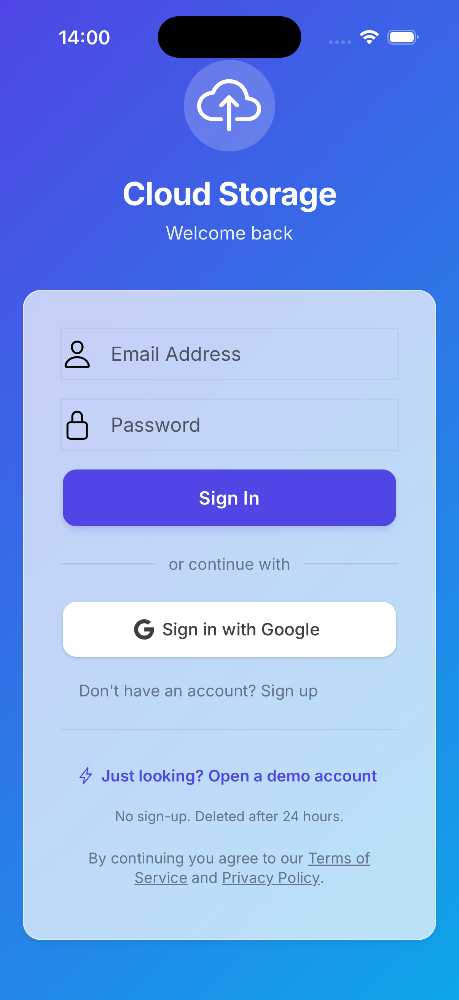

# ☁️ Cloud Storage App

[](https://github.com/Alexandr-Paleev/CloudStorageApp-Ionic/actions/workflows/ci.yml)
[](https://github.com/Alexandr-Paleev/CloudStorageApp-Ionic/releases)
[](https://opensource.org/licenses/MIT)
[](https://cloud-storage-app-ionic-v0.vercel.app)

A modern, **open-source** web application for storing, viewing, and managing files with PWA and mobile device support. Built with Ionic + React + Supabase, with Stripe billing and five storage backends.

🔗 **[Live Demo](https://cloud-storage-app-ionic-v0.vercel.app)** | 💎 **[Pro tier](#-pro-tier)** | 📦 **[Releases](https://github.com/Alexandr-Paleev/CloudStorageApp-Ionic/releases)** | 📓 **[Changelog](CHANGELOG.md)**

> ⚡ **No sign-up needed.** "Just looking? Open a demo account", at the foot of
> the login page, opens a private account seeded with a few files and deletes it
> after 24 hours. It is a real account — same row-level security, same quota,
> same Stripe test-mode checkout — because a demo running down a different code
> path stops proving anything.
>
> It sits at the foot of that page rather than the top on purpose. As the first
> element, styled like the submit button, it left two identical primary buttons
> on the card and pushed the real one below the fold — and the page read as a
> showcase rather than as a product.

> 💳 **The demo runs Stripe in test mode.** Real cards are declined — upgrade with `4242 4242 4242 4242`, any future expiry, any CVC. No money changes hands.

## 🔎 Engineering highlights

Three things in this repository worth more than the feature list, each written
up where it happened:

- **[An `anon` key deployed under the name `SUPABASE_SERVICE_ROLE_KEY`](#-postmortem-the-anon-key-that-was-named-supabase_service_role_key)** —
  for 221 days, across three environments, with every check green. It fails
  silently: RLS reduces every server-side query to zero rows, so handlers report
  missing data for rows that plainly exist. The lesson was to verify what a
  secret *is*, not what the variable is called — `assertServiceRoleKey` now
  refuses to start on the wrong one.
- **[Privilege escalation through a row-level security policy](docs/decisions/0002-billing-is-server-write-only.md)** —
  `profiles` shipped the obvious "users may update their own row" policy. RLS has
  no column-level granularity, so that included `tier`, and any user could grant
  themselves the paid plan from the browser with the published anon key.
- **[A storage quota enforced on one provider out of three, with a race on that one](docs/decisions/0004-quota-lives-in-the-database.md)** —
  images go straight from the browser to Cloudinary, so no server saw them and
  the limit rested on a check in the client. Even the guarded path was
  check-then-act: two parallel uploads both passed. It is now a trigger on the
  row every upload must reach, holding a lock while it counts.

Every decision of this kind has a short record in
**[`docs/decisions/`](docs/decisions/)** — context, decision, and the
consequences that cost something.

## 📋 Project Description

Cloud Storage App is a full-featured cloud file storage that allows users to:

- Securely store files in the cloud (PDFs, images, documents)
- View and manage files through a user-friendly interface
- Use the app in a browser, as an installable PWA, or as a native iOS build
- Automatically expand storage via Google Drive when the limit is exceeded
- Upgrade to a paid tier for more space and additional providers

## 📸 Screenshots

<p align="center">
  
</p>

| Upload — several files at once, and Pro users pick the backend                                                                                                                              | Plans — Stripe in test mode                                                                           |
| ---------------------------------------------------------------------------------------------------------------------------------------------------------------- | ----------------------------------------------------------------------------------------------------- |
|  |  |

| File view                                                                                                 | What a share link opens                                                                                                            |
| --------------------------------------------------------------------------------------------------------- | ---------------------------------------------------------------------------------------------------------------------------------- |
|  |  |

Share links are listed on the file they belong to, with their state and a way to revoke them:

<p align="center">
  
</p>

A change made with no network is written down rather than lost. The file is
already gone from the list — the queue is applied over the cached listing at
render — and the banner says the deletion has not reached the server yet:

<p align="center">
  
</p>

<p align="center">
  <br>
  <sub>The same dashboard as an installed PWA</sub>
</p>

## ✨ Key Features

### 🔐 Authentication

- ✅ Email/Password registration and login
- ✅ Google Account sign-in
- ✅ **One-click demo** — a throwaway account, seeded and signed in, no sign-up
- ✅ Protected routes (authorized users only)

### 📁 File Management

- ✅ Several files at once — picked or dropped onto the page — uploaded one after
  another, with progress per file and a failure that stops that file rather than the queue
- ✅ Search by name, six orderings and a filter by type. All three change the
  query, not the fifteen rows already on screen
- ✅ Nested folders with a breadcrumb path back to any level; folders can be renamed and deleted
- ✅ PDF and image preview
- ✅ File renaming and deletion — removed from the provider, not just from the list
- ✅ **Renames and deletions survive being offline.** The change is written to
  IndexedDB, applied to the screen immediately, and sent when the connection
  returns — coalesced, retried, and reported if it is finally refused
- ✅ Metadata display (size, upload date, type)

### 💾 Storage

- ✅ **500 MB** free per user, **5 GB** on Pro
- ✅ Five backends: Cloudinary, Supabase Storage, Cloudflare R2, Google Drive, Dropbox (Pro)
- ✅ Images routed to Cloudinary, other files to R2/Supabase — Pro users can pick a provider by hand
- ✅ Files over 16 MB go to R2 in parts, and can be paused and resumed — including after a reload
- ✅ Automatic Google Drive connection when the limit is exceeded
- ✅ Visual storage usage indicator, honest about accounts that are over the limit
- ✅ Quota is enforced in the database, on every path. A file exists in this app
  only once its row lands in `files`, whichever bucket holds the bytes, so a
  trigger there is what actually holds the line — including for uploads that go
  from the browser straight to a provider. `/api` refuses over-quota uploads
  before the bytes travel; the trigger is what makes that refusal binding.
  Google Drive and Dropbox are not counted: those files live in the user's own
  cloud, which is what makes overflowing into a connected Drive work at all.
- ⚠️ The size the trigger checks is the one written on the row, and the row is
  written by the browser. No path can skip the check, and no two uploads can
  claim the same free space — but a caller crafting the insert by hand can
  declare a smaller number than it uploaded. Closing that needs a size the
  server has verified, which needs the server to see the bytes, which is the
  4.5 MB request limit these direct uploads exist to avoid.

### 💳 Billing

- ✅ Free and Pro ($9/mo) tiers backed by Stripe
- ✅ Stripe Checkout for upgrades, Customer Portal for management
- ✅ Webhook keeps the tier in sync both ways — upgrade and cancellation
- ✅ Storage limits and allowed providers driven by the tier, not hardcoded

### 🔗 Sharing

- ✅ Public share links — send a file to someone without an account
- ✅ Links expire (7 days by default) and can be revoked from the file page
- ✅ Each file lists its links with their state: active, expired or revoked
- ✅ The recipient sees the file and nothing about its owner

> **What revoking does, precisely.** It stops `/s/:token` from opening. It cannot
> withdraw a file someone already downloaded, and on providers that serve
> permanent public URLs (Cloudinary, Dropbox, Google Drive) the direct file
> address keeps working for anyone who opened it. R2 and Supabase Storage are
> signed per request and do expire. The UI says this rather than promising a
> clean revoke.

### 📱 Platforms

- ✅ **Web** — works in any modern browser
- ✅ **PWA** — installable on phone or computer. Offline it serves the shell and
  the last listing _and_ accepts renames and deletions, which wait in IndexedDB
  until the network comes back
- ✅ **iOS** — built with Capacitor 8 and run on an iPhone 17 simulator
  (iOS 26.5); `ios/` is in the repository. Android is supported by Capacitor
  and has not been built here — see [Mobile app](#-mobile-app)

> 📱 **PWA Ready!** Install the app on your device: [Testing Guide](PWA_TESTING.md)

### 🎨 Interface

- ✅ Responsive design (works on all screen sizes)
- ✅ Modern UI based on Ionic components
- ✅ Dark/light theme, following the system setting
- ✅ Smooth animations and transitions

> **The dark theme was only half wired**, and it is worth writing down because
> nothing failed loudly. Nineteen rules across four stylesheets were written
> under `body.dark`, and no code ever added that class — so every one of them
> was dead. Meanwhile a `prefers-color-scheme` block set `--ion-text-color` to
> near-white on `:root`, which _did_ apply. An operating system set to dark
> therefore got near-white text on cards that stayed white: measured at
> **1.05:1** in the login form, meaning what you typed was invisible unless you
> selected it. `theme/dark-mode.ts` now syncs the class, which makes the
> existing CSS do what it always said it did, and the palette swaps `dark` and
> `light` the way Ionic's own dark theme does — `color="dark"` names a palette
> entry, not the text colour, so every `<IonText color="dark">` had gone
> near-black on a near-black card. Three more contrast failures found by
> measuring rather than looking are fixed alongside it.

## 🚀 Quick Start

### 1. Install Dependencies

```bash
npm install
```

### 2. Configure Environment Variables

Create a `.env` file in the project root:

```env
# Supabase Configuration
VITE_SUPABASE_URL=your_supabase_url
VITE_SUPABASE_ANON_KEY=your_supabase_anon_key

# Cloudinary Configuration
# The API key is deliberately absent: it belongs to the server-side block below,
# without the VITE_ prefix. src/env.ts parses the whole of import.meta.env, so
# Vite inlines every VITE_ variable into the public bundle — even ones no code
# reads. Anything prefixed here is published.
VITE_CLOUDINARY_CLOUD_NAME=your_cloud_name

# Required: API endpoint for file deletion
VITE_CLOUDINARY_DELETE_API_URL=https://your-project.vercel.app/api/cloudinary/delete

# Optional: Google Drive (for extra storage)
VITE_GOOGLE_CLIENT_ID=your_google_client_id

# Optional: Analytics (production only)
VITE_GA4_MEASUREMENT_ID=G-XXXXXXXXXX
VITE_HOTJAR_SITE_ID=1234567
VITE_HOTJAR_VERSION=6

# Billing — off by default, so a deployment without Stripe keys never shows a
# buy button that would answer with a 500
VITE_BILLING_ENABLED=true
# Shows the "test card" notice on the plans page; set while on Stripe test keys
VITE_BILLING_DEMO_MODE=true

# One-click demo. Two variables on purpose: the VITE_ one only shows the button,
# and a route that creates accounts must not be reachable because a client flag
# was left on. /api/demo/session answers 404 unless DEMO_ENABLED is set too.
VITE_DEMO_ENABLED=true
DEMO_ENABLED=true

# Where the native shells find the API. Only the iOS and Android builds read
# it: a Capacitor WebView serves the page from capacitor://localhost, so a
# relative /api path resolves against a local file server and 404s. The web
# build ignores it and keeps calling its own deployment — see ADR 0010.
VITE_API_ORIGIN=https://your-project.vercel.app

# Optional: Dropbox (Pro tier provider)
VITE_DROPBOX_APP_KEY=your_dropbox_app_key
VITE_DROPBOX_REDIRECT_URI=https://your-project.vercel.app/dropbox/callback
# Server-side copy — the OAuth code is exchanged in /api/dropbox/*, never in
# the browser, so the key must also exist without the VITE_ prefix.
DROPBOX_APP_KEY=your_dropbox_app_key
```

> **Dropbox tokens are handled server-side.** The refresh token is stored in the
> `dropbox_connections` table (see `migrations/003_add_dropbox_connections.sql`)
> and never reaches the browser; the app holds only a short-lived access token,
> in memory. Run migration 003 before enabling Dropbox.

### 3. Service Setup

#### Supabase

1. Create a project on [Supabase.com](https://supabase.com/)
2. Run every file in `migrations/` in the SQL Editor, in numerical order:
   - `000` — `files` and `folders`, with their RLS policies
   - `001` — the `profiles` table billing depends on
   - `002` — closes a privilege-escalation hole in the profiles RLS
   - `003` — the table that keeps Dropbox refresh tokens off the client
   - `004` — closes public read access to `shared_links` and switches it to
     token hashes; on a new project it finds nothing to fix and does nothing
   - `005` — creates `shared_links`, the table public share links live in
   - `006` — drops a dead policy on `files` and writes the Storage bucket and
     its policies down, so they stop living only in the dashboard
   - `007` — adds `profiles.bytes_used` and the trigger that keeps it and
     enforces the storage limit. **Apply it before deploying the code**: the
     API and the client both read that column, and without it uploads fail
   - `008` — drops `early_access`, a Pro-plan waitlist table that existed in the
     database, in no migration and in no line of code, and was accepting
     anonymous writes. On a new project it finds nothing and does nothing

   All nine are safe to re-run, so there is no need to track which ones have
   already been applied.

3. Enable **Google Auth** in Authentication -> Providers if needed.
4. The `files` bucket and its policies come from migration `006` — nothing to click.
   Creating the bucket by hand in the dashboard is what left a fresh project with
   RLS on `storage.objects` and no policies, so every Supabase Storage upload failed.

#### Cloudinary

1. Register on [Cloudinary](https://cloudinary.com/users/register/free)
2. No upload preset. Uploads are signed per request by `/api/cloudinary/sign`,
   which needs `CLOUDINARY_CLOUD_NAME`, `CLOUDINARY_API_KEY` and
   `CLOUDINARY_API_SECRET` set server-side (see the Vercel step below).
   - If you previously created an **unsigned** preset for this app, disable it:
     Settings → Upload → Upload presets. An unsigned preset lets anyone holding
     the cloud name — which ships in the client bundle — write into the account
     without having one here, and it is the path on which the storage quota was
     checked by nothing but the browser.
3. Enable PDF delivery: Settings → Security → Allow delivery of PDF and ZIP files

#### Cloudflare R2

1. Create a bucket and an API token with object read/write on it, then set
   `R2_ENDPOINT`, `R2_ACCESS_KEY_ID`, `R2_SECRET_ACCESS_KEY` and `R2_BUCKET_NAME`
   server-side, plus `VITE_R2_BUCKET_NAME` so the client knows R2 is available.
2. **Add a CORS policy to the bucket.** Uploads go from the browser straight to
   R2, so without one every upload fails at the preflight:

   ```json
   [
     {
       "AllowedOrigins": ["https://your-project.vercel.app", "http://localhost:8100"],
       "AllowedMethods": ["GET", "PUT"],
       "AllowedHeaders": ["*"],
       "ExposeHeaders": ["ETag"]
     }
   ]
   ```

   `ExposeHeaders: ["ETag"]` is the line that is easy to miss and hard to
   diagnose. Large files go up in parts, and the browser has to read each
   part's `ETag` to tell R2 how to reassemble them; without it the parts upload
   perfectly and the final assembly is rejected. The client says so by name
   rather than letting that happen.
3. Optional but recommended: a lifecycle rule that aborts incomplete multipart
   uploads after a few days. An upload nobody resumes leaves its parts in the
   bucket, and they are billable.

#### Vercel API (for file deletion)

1. Register on [Vercel](https://vercel.com/)
2. Connect your Git repository
3. Add environment variables in Vercel. **Server-only — never with a `VITE_`
   prefix**, which would inline them into the public bundle:
   - `CLOUDINARY_CLOUD_NAME`, `CLOUDINARY_API_KEY`, `CLOUDINARY_API_SECRET`
   - `SUPABASE_URL`, `SUPABASE_SERVICE_ROLE_KEY`
   - `STRIPE_SECRET_KEY`, `STRIPE_PRICE_ID_PRO_MONTHLY`, `STRIPE_WEBHOOK_SECRET`
   - `DROPBOX_APP_KEY` (only if Dropbox is enabled)
4. After deployment, copy the API URL and add it to `.env`:
   - `VITE_CLOUDINARY_DELETE_API_URL=https://your-project.vercel.app/api/cloudinary/delete`

> ⚠️ Check that `SUPABASE_SERVICE_ROLE_KEY` really holds the **service-role**
> key, not the anon key — they look alike and Supabase shows them side by side.
> Pasting the wrong one leaves every server-side query silently returning zero
> rows. See the [postmortem](#-postmortem-the-anon-key-that-was-named-supabase_service_role_key)
> for the one-liner that tells them apart.

#### Stripe (for the paid tier)

1. Create a product and a monthly price in the [Stripe Dashboard](https://dashboard.stripe.com/)
   and put the price id in `STRIPE_PRICE_ID_PRO_MONTHLY`
2. Add a webhook endpoint pointing at `https://your-project.vercel.app/api/stripe/webhook`,
   subscribed to `checkout.session.completed`, `customer.subscription.updated`,
   `customer.subscription.deleted` and `invoice.payment_failed`
3. Copy that endpoint's signing secret into `STRIPE_WEBHOOK_SECRET` — the one
   `stripe listen` prints is for local development only and will not verify
   production events
4. Set `VITE_BILLING_ENABLED=true` to show the plans page, and
   `VITE_BILLING_DEMO_MODE=true` while running on test keys
5. Locally, forward events instead of registering an endpoint:
   `stripe listen --forward-to localhost:8100/api/stripe/webhook`

#### Google Drive (optional)

1. Create a project in [Google Cloud Console](https://console.cloud.google.com/)
2. Enable Google Drive API
3. Create OAuth 2.0 Client ID
4. Add `VITE_GOOGLE_CLIENT_ID` to `.env`

#### Analytics (optional)

Analytics are automatically enabled in production when environment variables are set.

**Google Analytics 4:**

1. Create a property in [Google Analytics](https://analytics.google.com/)
2. Get your Measurement ID (starts with `G-`)
3. Add `VITE_GA4_MEASUREMENT_ID` to `.env`

**Hotjar:**

1. Create a site in [Hotjar](https://www.hotjar.com/)
2. Get your Site ID from the tracking code
3. Add `VITE_HOTJAR_SITE_ID` to `.env`

> **Privacy First**: Hotjar only runs on web (not native mobile apps). File names and sensitive data are automatically masked using `data-hj-suppress` attributes.

### 4. Run Application

```bash
# Development mode
npm run dev

# Production build
npm run build

# Preview build
npm run preview
```

The app will be available at: `http://localhost:8100`

## 📦 Tech Stack

- **Frontend**: React 19 + Ionic 9 + TypeScript 5.9
- **File Storage**: Cloudinary, Supabase Storage, Cloudflare R2, Google Drive, Dropbox (Pro)
- **Database**: Supabase (PostgreSQL, RLS)
- **Authentication**: Supabase Auth
- **Billing**: Stripe (Checkout, Customer Portal, webhooks)
- **State Management**: TanStack Query + React Context API
- **Routing**: React Router DOM
- **Build**: Vite + Capacitor
- **Backend API**: Vercel Functions
- **Testing**: Vitest (node and jsdom projects) + Playwright (e2e), run in GitHub Actions
- **Analytics**: Google Analytics 4 (GA4) + Hotjar
- **Error Tracking**: Sentry

## 🏗️ Architecture



**The rule the layout follows:** anything holding a secret runs in `/api`. The
browser bundle is public — Vite inlines every `VITE_`-prefixed value into it —
so provider credentials, the Stripe secret key, the Supabase service-role key
and Dropbox refresh tokens are only ever read server-side. The client talks to
Postgres directly, but always through the anon key with RLS applied, and only
for rows it owns.

Uploads are the deliberate exception: files go from the browser straight to the
provider — a presigned URL for R2, a per-request signature for Cloudinary —
because proxying them through a serverless function would cap uploads at
Vercel's 4.5 MB request body limit. That means no server sees the bytes, so the
quota cannot be enforced by watching them go past. It is enforced where the
upload has to end up instead: a trigger on `files` checks the limit and updates
the counter in one statement, under a row lock, so two simultaneous uploads
cannot both fit into the same remaining space. `/api` still refuses over-quota
uploads first, to save the round trip — but it is the pre-flight, not the gate.

### Security decisions worth knowing

| Decision                                                                              | Reason                                                                                                                                                                                                                                                                                                |
| ------------------------------------------------------------------------------------- | ----------------------------------------------------------------------------------------------------------------------------------------------------------------------------------------------------------------------------------------------------------------------------------------------------- |
| Billing columns are server-write only                                                 | RLS has no column-level granularity, so a self-update policy would let anyone set `tier = 'pro'`                                                                                                                                                                                                      |
| Dropbox refresh tokens live in `dropbox_connections`, never in the browser            | an XSS could otherwise reach the user's Dropbox indefinitely                                                                                                                                                                                                                                          |
| Share tokens are stored as SHA-256 hashes                                             | a leak of `shared_links` then reveals nothing usable                                                                                                                                                                                                                                                  |
| `assertServiceRoleKey` refuses to start on an anon key                                | swapping the two keys fails silently: queries return nothing instead of erroring                                                                                                                                                                                                                      |
| Ownership is checked in `/api`, never trusted from the client                         | the presigned URL writes straight to the bucket, so the client check is advisory                                                                                                                                                                                                                      |
| The storage quota is enforced by a trigger on `files`, not only in `/api`             | uploads go from the browser straight to the provider, so no handler sees them; the row is the one thing every path must reach, and a row lock there also closes the check-then-act race the API check had on its own                                                                                  |
| Cloudinary uploads are signed per request, never by an unsigned preset                | an unsigned preset is writable by anyone holding the cloud name, which ships in the client bundle — and it was the path production used for every image                                                                                                                                               |
| The quota trusts the size on the row, and this says so rather than implying otherwise | uploads never pass through a server, so nothing server-side can weigh them; the trigger makes the limit unskippable and the race impossible, and the declared size is the honest boundary of what that buys                                                                                           |
| The demo endpoint needs a server-side `DEMO_ENABLED`, not just the client flag        | a route that creates accounts should not open because a `VITE_` variable was left set in a preview                                                                                                                                                                                                    |
| Demo accounts are swept by email prefix, never by age alone                           | the sweep runs with the service-role key; a filter on age alone would eventually reach a real account                                                                                                                                                                                                 |
| The demo rate limit is 20/hour per address, and per instance                          | an office or a campus behind one NAT is a single address, so a tight limit turns away the visitors this exists for; the counter lives in module scope, so it resets on a cold start and is not a defence against a distributed attempt — a shared counter is what all of these limits still want |
| Share and upload limits count per account, and per address before the token check    | an address can be a whole office, so the limit that matters belongs to the account; the address one runs first because validating a token costs a round trip that an anonymous caller must not be able to buy by repeating the request. Revoking a share link is exempt                                |

### Security headers

`vercel.json` sends a Content-Security-Policy, HSTS, `X-Content-Type-Options`,
`Referrer-Policy`, `Permissions-Policy` and `X-Frame-Options` on every response.
The interesting parts:

- **`frame-ancestors 'none'`, `object-src 'none'`, `base-uri 'self'`,
  `form-action 'self'`** — the four that cost nothing and buy the most:
  clickjacking, plugin content, a rewritten `<base>`, and a form posting
  credentials to somebody else's host.
- **`script-src` still carries `'unsafe-inline'`**, and that is a real weakness
  rather than an oversight. The build emits no inline `<script>` at all — gtag.js
  and Hotjar are what need it. Removing it means per-request nonces, which need
  a server rendering the HTML rather than a static bundle.
- **`connect-src https:` is deliberately wide.** The Supabase project ref, the R2
  account and the Sentry ingest host all differ per deployment, and `vercel.json`
  is checked in, so a hardcoded list would break every fork.

`lib/csp.test.ts` parses the header out of `vercel.json` and asserts that every
origin the app injects a script from is allowed. The policy is a string inside a
JSON file — nothing else in the toolchain can see it, and a mistake there shows
up only in production, in whichever browser the visitor happened to bring.

### What the browser downloads first

Measured from `npm run build`, gzipped, before anything is rendered:

|                             | Before                     | After                      |
| --------------------------- | -------------------------- | -------------------------- |
| Initial JS + CSS            | 1 863 KB / **451 KB gzip** | 1 714 KB / **401 KB gzip** |
| Chunks on the critical path | 6                          | 6 (Sentry out, facade in)  |

Two changes, both cheap:

- **Sentry is no longer imported at startup.** It sat at the top of `main.tsx`
  _and_ of `ErrorBoundary.tsx`, so 151 KB of crash reporter (51 KB gzipped, an
  ninth of the shell) was fetched before the first paint — by a library that has
  nothing to report until the app is running. `src/observability/sentry.ts` is
  now a facade every module imports instead; the real package arrives on
  `requestIdleCallback`, and events raised in the meantime are queued rather
  than dropped. The cost, stated plainly: `browserTracingIntegration` no longer
  sees the initial pageload transaction.

  Two traps on the way, both only visible in the build output:

  1. `import('@sentry/react')` resolves to the whole module namespace, which
     Rollup must keep intact — every integration the package ships became
     reachable and the chunk grew from 151 KB to **494 KB**. Importing
     `observability/sentry-client.ts`, which re-exports exactly four symbols,
     gives Rollup a namespace small enough to shake against.
  2. Rollup then merged the facade _into_ the Sentry chunk, so the static import
     pulled the reporter back onto the critical path — the lazy import bought
     nothing, and `dist/index.html` still listed `sentry-*.js` under
     `modulepreload`. `manualChunks` now assigns the facade its own chunk.

- **Inter is linked from `index.html` with a preconnect.** It was an `@import` at
  the top of `theme/variables.css`, which is the slowest way to load a font: the
  browser has to download and parse that stylesheet before it discovers a font
  is needed at all.

The remaining 239 KB gzipped is Ionic, and it is structural rather than
something to tune — the framework registers its components eagerly.

#### The number is now a budget, not a note in a README

`npm run size` measures what `dist/index.html` actually pulls in — the entry
script, every preloaded chunk, every stylesheet — and fails when it grows past
a ceiling set just above today's figure. It runs on every push and prints the
table onto the run page:

| | Measured | Budget |
| --- | ---: | ---: |
| First load (JS + CSS) | 401.0 kB | 420 kB |
| Largest chunk (Ionic) | 239.4 kB | 250 kB |
| All assets, route chunks included | 485.1 kB | 520 kB |

A budget set to a round number nobody measured gets raised the first time it is
hit. These are set a few percent above the build, so the pull request that adds
a 40 KB dependency is the one that has to justify it.

#### Lighthouse, on the same run

`npm run lighthouse` audits the built `dist/` — the shell and both static legal
pages — with the desktop preset. Current scores:

| | Performance | Accessibility | Best practices | SEO |
| --- | ---: | ---: | ---: | ---: |
| App shell | 97 | 100 | 100 | 100 |
| Privacy policy | 100 | 100 | 100 | 100 |
| Terms of service | 100 | 100 | 100 | 100 |

CI asserts accessibility, best practices and SEO at ≥ 95 — near-deterministic
audits of markup and metadata — and performance at ≥ 80, low enough that a busy
runner cannot fail the build on its own and high enough to catch a blocking
script returning to the critical path.

The legal pages did not start at 100. The first run found body text at `#999`
on white (2.8:1, against the 4.5:1 that text needs), links distinguished by
colour alone, no meta description, and four GitHub links pointing at a username
that does not exist — leftovers of a rename that the earlier link sweep missed
because these two pages are static HTML and nothing else references them.

## 🚀 Deployment

### Vercel (recommended)

1. Install Vercel CLI: `npm install -g vercel`
2. Deploy: `vercel --prod`

## 📱 Mobile app

The iOS project is in `ios/` and the app runs: built with Capacitor 8 against
Xcode 26.6, launched on an iPhone 17 simulator under iOS 26.5.

Four Capacitor plugins do the work that makes it a shell rather than a frame
around a website: the system share sheet for links, a keyboard that resizes the
body instead of the whole WebView, haptic feedback on the one irreversible tap,
and a status bar that follows the theme. The status bar is left **overlaying**
the page — `setOverlaysWebView(false)` is the Android reflex, and on iOS it
insets the WebView and fills the gap with the window background, which is a
black band with no clock in it. Ionic's `--ion-safe-area-top` already keeps
every header clear of it.

<p align="center">
  
</p>

```bash
npm run build
npx cap sync ios
npx cap open ios     # then Run, or:
npx cap run ios --target "<simulator id from npx cap run ios --list>"
```

**Requirements**: a Mac with Xcode. CocoaPods is *not* needed — Capacitor 8
distributes plugins through Swift Package Manager. Publishing to the App Store
additionally needs an Apple Developer account ($99/year).

### What the shell needed that the browser did not

A Capacitor WebView serves the page from `capacitor://localhost`, and that one
fact broke three things. All three are fixed;
[ADR 0010](docs/decisions/0010-the-native-shell-has-its-own-origin.md) has the
reasoning.

- **Eleven `fetch` calls named their route with a path.** Correct in a browser,
  where the page and the functions share a deployment; a 404 in the shell.
  `apiUrl()` prefixes `VITE_API_ORIGIN` when — and only when — the app is
  running natively, so the web build still calls its own deployment.
- **The API had to be told who is calling.** `capacitor://localhost` and
  `http://localhost` are answered by name, never `*`: these routes read bearer
  tokens and open Stripe sessions.
- **Sign in with Google could not come back to a page.** It leaves through the
  system browser and returns through `com.cloudstorage.app://auth/callback`.

### Two settings that live outside this repository

Email and password sign-in works on the device as built. Google does not until
both of these are in place:

1. **Supabase → Authentication → URL Configuration**: add
   `com.cloudstorage.app://auth/callback` to the redirect allow-list.
2. **Google Cloud console**: add an iOS OAuth client for the bundle id
   `com.cloudstorage.app`.

### If `codesign` refuses the bundle

> `App.app: resource fork, Finder information, or similar detritus not allowed`

This repository lives in an iCloud-synced folder, and the file provider stamps
`com.apple.FinderInfo` on directories it syncs — including the ones
`npx cap run ios` creates under `ios/DerivedData`, which codesign then refuses.
Xcode's own derived-data location is outside the synced tree, so opening the
project and pressing Run works; the CLI's in-project path is what fails. To
stay on the command line, point the build somewhere else:

```bash
xcodebuild -project ios/App/App.xcodeproj -scheme App -configuration Debug \
  -destination "id=<simulator id>" -derivedDataPath ~/Library/Developer/Xcode/DerivedData/CloudStorage build
```

### Android

Not built here. Capacitor supports it and `npx cap add android` is the same one
command, but it needs a JDK and the Android SDK, and nothing in this project
has been run against either — so the README does not claim it.


## 📁 Project Structure

```
cloud-storage-app/
├── src/
│   ├── pages/
│   │   ├── Login.tsx              # Login/Register page
│   │   ├── Dashboard.tsx          # User file list
│   │   ├── Upload.tsx             # File upload page
│   │   └── FileView.tsx           # File view/manage page
│   ├── services/
│   │   ├── auth.service.ts        # Authentication service
│   │   ├── storage.service.ts     # Main file service
│   │   ├── cloudinary.service.ts  # Cloudinary service
│   │   ├── googledrive-auth.service.ts  # Google Drive OAuth
│   │   └── googledrive.service.ts # Google Drive service
│   ├── providers/
│   │   ├── storage.provider.ts    # Storage Provider architecture
│   │   └── impl/                  # Provider implementations
│   ├── contexts/
│   │   └── AuthContext.tsx        # Authentication context
│   ├── components/
│   │   ├── PrivateRoute.tsx       # Protected route component
│   │   └── PageViewTracker.tsx    # Analytics page view tracker
│   ├── observability/
│   │   ├── sentry.ts              # Facade — keeps Sentry off the critical path
│   │   └── sentry-client.ts       # Four re-exports, so the chunk stays shakeable
│   ├── hooks/
│   │   └── useAnalytics.ts        # GA4 + Hotjar analytics hook
│   ├── types/
│   │   └── analytics.types.ts     # Analytics event types
│   ├── supabase/
│   │   └── supabase.config.ts     # Supabase configuration
│   ├── App.tsx                    # Main component
│   └── main.tsx                   # Entry point
├── api/                           # Vercel Functions — anything holding a secret
│   ├── cloudinary/[action].ts     # sign (quota-checked) and delete (ownership-checked)
│   ├── demo/session.ts            # Throwaway account for "Try the demo"
│   ├── dropbox/                   # OAuth exchange, token refresh, disconnect
│   ├── r2/                        # Presigned URLs, quota enforced here
│   └── stripe/                    # Checkout, Customer Portal, webhook
├── lib/                           # Shared by api/ and tests (auth, stripe, format)
├── migrations/                    # The whole schema, in order, each re-runnable
├── e2e/                           # Playwright specs
├── capacitor.config.ts            # Capacitor config
├── vite.config.ts                 # Vite config (incl. vendor chunk splitting)
└── package.json
```

Anything that needs a secret lives in `api/`. The browser bundle is public — Vite
inlines every `VITE_`-prefixed value into it — so provider credentials, the
Stripe secret key, the Supabase service-role key and Dropbox refresh tokens are
only ever read server-side.

> **`api/` is full.** Vercel turns every `.ts` file there into its own Serverless
> Function and the Hobby plan allows twelve; `api/demo/session.ts` was the
> twelfth. This is why `api/share.ts` routes three verbs through one file, and
> why the next server-side route has to either share an existing file or wait
> for a plan that allows more. It already cost one thing worth naming: a
> collector for CSP violation reports, which would have let the policy run in
> report-only mode first.

## 🔒 Limits and Restrictions

### Application

|                    | Free                                           | Pro ($9/mo)        |
| ------------------ | ---------------------------------------------- | ------------------ |
| Storage            | 500 MB                                         | 5 GB               |
| Providers          | Cloudinary, Supabase Storage, R2, Google Drive | + Dropbox          |
| Provider selection | automatic                                      | manual, per upload |

- **Extra storage**: Google Drive (15 GB free) — auto-connects when limit is reached
- **Max single file size**: not enforced. The figure of 50 MB appeared here before
  anything implemented it; no check exists in the client, in `/api`, or on the
  bucket (`file_size_limit` is null). Providers impose their own ceilings — Vercel
  caps a function request body at 4.5 MB, which is why R2 uploads are presigned.
- Cancelling Pro drops the limit back to 500 MB. Files already stored stay
  readable; only new uploads are refused until the account is back under quota.

### Cloudinary (Free Plan)

- **Storage**: 25 GB
- **Bandwidth**: 25 GB/month
- **Transformations**: 25,000/month

### Supabase (Free Tier)

- **Database**: 500MB
- **Storage**: 1GB (5GB bandwidth)

## 🛠️ Development

```bash
# Linting
npm run lint

# Code formatting
npm run format

# Unit tests (Vitest) — both projects, server and client
npm test

# ...with the coverage report CI prints as two tables
npm run test:coverage

# End-to-end tests (Playwright)
npm run test:e2e

# Type-check src and api, then build
npm run build

# What the browser downloads before first paint, against its budget
npm run size

# Lighthouse against dist/ — the same audit CI asserts on
npm run lighthouse

# Regenerate the demo seed files and the link-preview image
npm run generate:demo-assets
```

GitHub Actions runs lint, both type-check passes, an audit of production
dependencies, a bundle-size budget, Lighthouse, unit and e2e tests on every
pull request. The e2e suite runs against two dev servers: one as deployed, and
one with `VITE_R2_BUCKET_NAME` set, where the resumable-upload spec answers
every `/api/r2/*` call itself, and in three Playwright projects: Desktop
Chrome, the same browser pointed at the R2 server, and Pixel 7 for the specs
whose subject is the phone. `main` is protected:
those checks are required, and changes land through pull requests only.

### What the tests cover, and what they deliberately do not

Two Vitest projects, because the two halves of this app run in different
places: `server` executes the Vercel handlers and the `lib/` helpers under
node, `client` renders the React layer under jsdom. CI prints their coverage
as two tables — a single blended percentage would hide which half a pull
request moved.

The target is not a percentage. It is that everything deciding **access,
money and quota** has a test:

- `authenticateUser` — the gate every handler goes through, and the one thing
  every handler test mocks, so it needs a test of its own.
- `ProviderManager.selectProvider` — which backend a file lands on, and that
  choosing one by hand still cannot walk past the quota.
- The rollback in `storage.service.uploadFile` — the bytes reach the bucket
  before the row exists, so a failed insert has to delete them again. The
  compensating half of a transaction Postgres cannot give us.
- The storage meter — cancelling Pro drops the limit back to 500 MB without
  deleting anything, so the bar stops at full while the number keeps counting.
- Share-link state — `stateOf()` in the browser deliberately re-implements
  `shareUnusableReason()` from `lib/share.ts` rather than pull `node:crypto`
  into the bundle. Two implementations can drift; each side is tested.

Pages are left to Playwright rather than jsdom: `e2e/` opens a throwaway
account per test and drives the real file lifecycle, share links, quota, folder
navigation, search, a multi-file upload and the offline queue against a live
Supabase project. Rendering a page in jsdom proves the markup exists; it does
not prove an upload works.

**One check runs the built bundle rather than the source.** `npm run smoke`
opens `dist/` in a real browser and asks whether the page rendered anything at
all. It exists because nothing else could: `npm run dev` serves unbundled
modules, so `manualChunks` in `vite.config.ts` never executes there, and the
Playwright suite runs against that dev server. A split that put React and
react-dom in different chunks painted a blank page while lint, 621 unit tests,
the whole e2e suite and the bundle budgets stayed green.

**Accessibility is asserted on the rendered DOM**, at WCAG 2.1 A and AA, by
`@axe-core/playwright` — on the login page, the dashboard with folders and
files on it, the upload page with a queue, the file view and the plans page.
`eslint-plugin-jsx-a11y` reads the source and Lighthouse audits the built
shell, which behind a login form is an empty page and two static documents;
everything the app actually is had been checked by neither. The first run found
five rule classes, including a delete button nested inside the button that
opens the file, and a list whose children were not list items.

**One project runs at phone size** (`mobile`, Pixel 7) rather than repeating the
whole suite twice. It carries the checks whose subject is the phone itself:
that nothing scrolls sideways, that the primary action answers a tap rather than
only a mouse, and that the layout at that width is as accessible as the wide
one. The app is sold as a PWA and shipped through Capacitor, and CI used to
measure one browser at one size.

## 🔍 Postmortem: the `anon` key that was named `SUPABASE_SERVICE_ROLE_KEY`

Worth writing down, because no test in this repository could have caught it —
the bug was not in the code at all.

**The symptom.** Right after billing went live in production, `Upgrade to Pro`
answered with `500` and a message the handler itself raises:

```
No profile row for user 4a242a2f-... — has migrations/001_add_profiles_and_billing.sql been run?
```

The migration had been run. The row was there — a direct query against the
database returned it, `stripe_customer_id` and all.

**The cause.** Every serverless function builds its Supabase client in
`lib/auth.ts` from `SUPABASE_URL` and `SUPABASE_SERVICE_ROLE_KEY`. The project
URL was correct. The key was not: decoding the JWT payload showed
`"role": "anon"`. An anon key had been stored under the service-role name, in
all three Vercel environments, 221 days earlier.

A service-role key bypasses RLS; an anon key does not. `profiles` allows
`SELECT` only on `auth.uid() = id`, and a server-side client carries no user
session — so it matched zero rows. Postgres was not broken and RLS was not
misconfigured. The server was simply asking as a stranger.

**Why it stayed hidden for so long.** Until v3 the production branch had no
`api/` directory, so none of this code ever ran there. It also survived a
signed-webhook check that returned `200`: that probe used an event type the
handler ignores, so it never touched the database. The first request that
actually read a table was the one that failed.

**How to check a key in one line.** The role is in the JWT payload, in plain
sight:

```bash
# prints: anon  — or: service_role
cut -d. -f2 <<< "$SUPABASE_SERVICE_ROLE_KEY" | base64 -d 2>/dev/null | sed 's/.*"role":"\([^"]*\)".*/\1/'
```

**What it changed here.** Two habits, both cheap:

- verify what a secret _is_, not what the variable is called — names are set by
  hand, and a hand can paste the wrong value;
- when a green check is claimed as proof, ask which code path it actually
  exercised. A `200` from a probe that never reached the database proved only
  that the signature matched.

A sibling of the same class had been fixed days earlier: `STRIPE_WEBHOOK_SECRET`
in production held a secret from `stripe listen`, left over from local testing,
while the Stripe account had no registered webhook endpoint at all. Both were
configuration, both were invisible to CI, and both only surfaced when a real
request finally travelled the whole path.

## 🔍 Postmortem: the dependency policy that hid the vulnerabilities it was meant to avoid

`.github/dependabot.yml` ignores major version bumps, and the reasoning was
sound enough to be worth quoting: majors are migrations, not updates, and the
first Dependabot run proposed seven at once — Capacitor 6 to 8, Ionic 8 to 9,
TypeScript 5 to 7, react-router 6 to 7, ESLint 8 to 10 — two of which failed CI
outright. The comment ended with a sentence that turned out to be false:

> Minor and patch still arrive weekly, **which is where security fixes land.**

**The symptom.** `npm audit --omit=dev` reported nine vulnerabilities, four of
them high, against a repository whose checks had been green for months. Twelve
separate `undici` advisories — request smuggling, CRLF injection, response
queue poisoning — reachable through `@vercel/node`, which was pinned at 5.x
while 10.x was current.

**The cause.** The fix was only available in a major, so the ignore rule
suppressed it, and Dependabot opened nothing. Nothing else was watching: CI ran
lint, two type-check passes, unit tests and Playwright, and not one of them has
an opinion about a published advisory. The policy did not fail — it worked
exactly as written, and what it was written to do turned out to include this.

**What it took to clear.** Less than the alert count suggested, because the
count was measuring the wrong thing:

- `@vercel/node` is imported for `VercelRequest` and `VercelResponse` and
  nothing else — Vercel supplies the runtime itself. It belonged in
  `devDependencies` all along, where its transitive tree never reaches
  production.
- `ajv` was a direct dependency that no file in this repository imports. It came
  in transitively through `vite-plugin-pwa` and `eslint` regardless.
- `cloudinary` was the one genuine production high, and the only real migration:
  v1 to v2. The app uses `v2.config()` and `v2.uploader.destroy()`, neither of
  which changed.

Production dependencies went from nine vulnerabilities (four high) to three
(one low, two moderate, none high). The two that remained were `react-router`,
which needs the v7 migration, and a pinned `esbuild` — both known, neither
hidden.

The `esbuild` one turned out not to be a production dependency at all. It had
been pinned into `dependencies` to fix a Vercel build that a hand-pinned
`@esbuild/darwin-arm64` had broken — the remedy for which was to stop declaring
the binary, not to declare the compiler. No file imports it, and Vite resolves
its own nested copy regardless. Dropping the declaration took production
dependencies from 106 to 100 and the report to **0 critical, 0 high, 2 moderate,
0 low**, which is the same lesson one layer down: an advisory count is only as
honest as the boundary it is counted against.

**What changed.** One CI step, which is the part that matters more than the
upgrades:

```yaml
- name: Audit production dependencies
  run: npm run audit:prod
```

The step ran `npm audit --omit=dev --audit-level=high` directly until v4.2.0,
when a registry outage failed it twice in a day and the command moved into
[`scripts/audit-production.mjs`](scripts/audit-production.mjs) — which tells a
verdict from an unreachable endpoint. `--omit=dev` is load-bearing and unchanged
in either form. A vulnerability in a build tool is not a vulnerability in what
the browser downloads, and a step that fails over one trains people to skip
reading it. The ignore rule stays — it was right about churn — but it is no
longer the only thing standing between an advisory and this repository.

The habit this adds to the [first postmortem](#-postmortem-the-anon-key-that-was-named-supabase_service_role_key)'s
two: a policy that suppresses noise needs something else watching for what it
suppresses, or the silence it produces is indistinguishable from safety.

## 💎 Pro Tier

Shipped in [v3.0.0](https://github.com/Alexandr-Paleev/CloudStorageApp-Ionic/releases/tag/v3.0.0). Upgrading happens in the app, through Stripe Checkout.

|                        | Free                                           | Pro — $9/month |
| ---------------------- | ---------------------------------------------- | -------------- |
| Storage                | 500 MB                                         | **5 GB**       |
| Providers              | Cloudinary, Supabase Storage, R2, Google Drive | **+ Dropbox**  |
| Choose upload provider | —                                              | ✅             |
| Google Drive overflow  | ✅                                             | ✅             |

Manage or cancel a subscription from the Stripe Customer Portal, reachable from
the plans page. Cancelling takes effect immediately and the tier drops back to
Free — see [Limits](#-limits-and-restrictions) for what happens to files already
stored.

> **The public demo runs on Stripe test keys.** Real cards are declined; use
> `4242 4242 4242 4242` with any future expiry and any CVC. Nothing is charged.

### Not built (and not promised)

Earlier versions of this README advertised OneDrive, AWS S3, team collaboration
and white-labelling as "coming soon". None of that exists, and none of it is
planned — the list is gone rather than left to age.

## 🤝 Contributing

We welcome contributions! Please follow these steps:

1. Fork the repository
2. Create a feature branch (`git checkout -b feature/AmazingFeature`)
3. Commit your changes (`git commit -m 'feat: add amazing feature'`)
4. Push to the branch (`git push origin feature/AmazingFeature`)
5. Open a Pull Request

Code style is enforced automatically — ESLint and Prettier run on staged files through a pre-commit hook, so there is nothing to configure by hand. Commit messages follow [Conventional Commits](https://www.conventionalcommits.org/) (`feat:`, `fix:`, `chore:`).

## 📝 License

This project is licensed under the MIT License - see the [LICENSE](LICENSE) file for details.

## 🤝 Support

- 💬 **Issues**: [GitHub Issues](https://github.com/Alexandr-Paleev/CloudStorageApp-Ionic/issues)
- 📧 **Email**: support@cloudstorage.app (for Pro customers)

## 📄 Legal

- **[Privacy Policy](PRIVACY_POLICY.md)** - How we handle your data
- **[Terms of Service](TERMS_OF_SERVICE.md)** - Rules and guidelines

## 🌟 Star History

If you find this project useful, please give it a ⭐ on GitHub!

---

**Created with ❤️ by Aleksandr Paleev**

**Stack**: Ionic + React + TypeScript + Supabase + Cloudinary + Vercel
